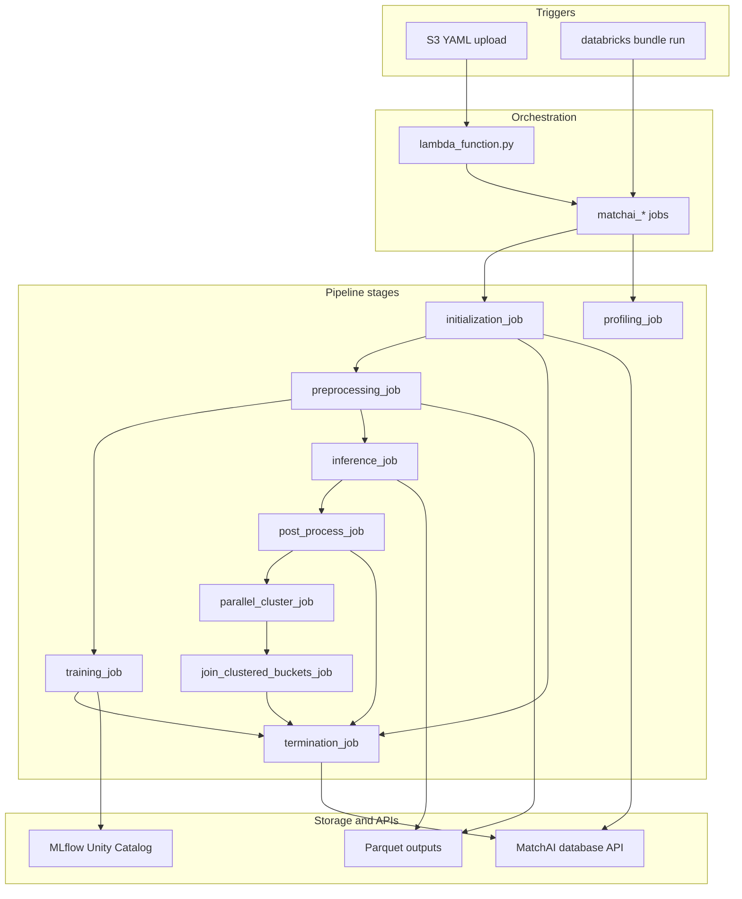
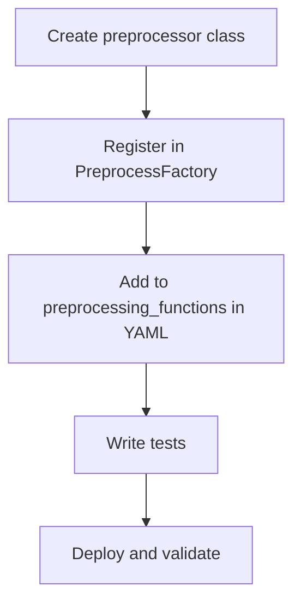

# MatchAI — Developer Playbook

Engineer-facing documentation for the `mlp_consumer_match` codebase.

---

## Architecture



MatchAI packages pipeline stages as wheel entry points invoked by Databricks jobs. Configuration is loaded via Hydra from a runtime `--config-path`. The Lambda layer in `src/mlp_consumer_match/lambda/` orchestrates jobs from S3 YAML uploads but is not included in the wheel.

---

## Job orchestration

| Job | Task order | Entry points used |
|-----|------------|-------------------|
| `matchai_training_job` | `initialization_task` → `preprocess_task` → `training_task` → `termination_task` | `initialization_job`, `preprocessing_job`, `training_job`, `termination_job` |
| `matchai_linkage_inference_job` | `initialization_task` → `preprocess_task` → `parallel_inference` (for-each salt key → `matchai_parallel_inference_job`) → `post_process_task` → `termination_task` | `initialization_job`, `preprocessing_job`, `inference_job` (sub-job), `post_process_job`, `termination_job` |
| `matchai_dedupe_inference_job` | `initialization_task` → `preprocess_task` → `parallel_inference` → `post_process_task` → `cluster_task` (for-each bucket → `matchai_parallel_cluster_job`) → `join_clustered_buckets_task` → `termination_task` | `initialization_job`, `preprocessing_job`, `inference_job` (sub-job), `post_process_job`, `parallel_cluster_job` (sub-job), `join_clustered_buckets_job`, `termination_job` |
| `matchai_profiling_job` | `profiling_task` | `profiling_job` |
| `matchai_parallel_inference_job` | `inference_task` | `inference_job` |
| `matchai_parallel_cluster_job` | `parallel_cluster_task` | `parallel_cluster_job` |

`matchai_parallel_inference_job` is defined per bundle target in `resources/targets.yml`, not in a standalone `resources/*.yml` job file.

---

## Wheel entry points

Registered in `setup.py` under the `"entry_points"` group key (not the standard `"console_scripts"`):

| Entry point | Module |
|-------------|--------|
| `preprocessing_job` | `mlp_consumer_match.preprocess.preprocess_main:main` |
| `training_job` | `mlp_consumer_match.train.train_main:main` |
| `profiling_job` | `mlp_consumer_match.profiling.profiling_main:main` |
| `inference_job` | `mlp_consumer_match.inference.inference_main:main` |
| `post_process_job` | `mlp_consumer_match.post_process.post_process_main:main` |
| `parallel_cluster_job` | `mlp_consumer_match.cluster.cluster_main:main` |
| `join_clustered_buckets_job` | `mlp_consumer_match.cluster.join_clustered_buckets:main` |
| `initialization_job` | `mlp_consumer_match.workflow_lifecycle.workflow_initialization:main` |
| `termination_job` | `mlp_consumer_match.workflow_lifecycle.workflow_termination:main` |

---

## Config loading

`ConfigLoader` is a singleton. Call `ConfigLoader().get_or_load_config("<name>")` where `<name>` is one of: `preprocess`, `train`, `inference`, `profiling`, `cluster`. Hydra loads YAML from `--config-path` passed at job runtime.

| Method | Returns |
|--------|---------|
| `get_preprocess_path(file_name=None)` | `{save_path}/{model_name}/{date_partition}/preprocessed/{job_run_id}[/{file_name}]` |
| `get_prediction_path(include_salt_key_dir=True, include_salt_key_glob_pattern=True)` | `{save_path}/.../predictions/{job_run_id}[/salt_keys][/**]` |
| `get_salt_key_prediction_path(include_partition=True)` | Per salt-key pair prediction parquet path |
| `get_bucket_path(bucket_name=None)` | `{save_path}/.../predictions/{job_run_id}/buckets[/{bucket_name}]` or `None` if no `bucket_queries` |
| `get_cluster_base_path()` | `{save_path}/.../cluster/{job_run_id}` or `None` if no `cluster_on` |
| `get_cluster_bucket_path(bucket_name=None)` | `{save_path}/.../cluster/{job_run_id}/buckets[/{bucket_name}]` |
| `get_uc_destination_path(workflow_type="train")` | `/Volumes/{uc_catalog}/{uc_schema}/{uc_volume}/{job_run_id}` |
| `get_profiling_output_path(file_name)` | `{save_path}/{model_name}/{date_partition}/profiling/{job_run_id}/{file_name}` |
| `generate_salt_key_pairs(salt_keys)` | List of salt-key pair JSON strings for for-each orchestration |
| `get_bucket_queries()` | Bucket query dict; returns default `SELECT * FROM __PREDICTIONS__` when `bucket_queries` is absent |

---

## Pipeline entry points summary

| Entry point | Purpose | Side effects | Raises |
|-------------|---------|--------------|--------|
| `initialization_job` | Fetch workflow type, load train/inference config, create `match_run_detail` with `RUNNING`, update `match_config` with merged YAML | Database API writes to `match_config`, `match_run_detail` | `ValueError` on invalid `workflow_type` |
| `preprocessing_job` | Read sources, apply `PreprocessPipeline`, write parquet, publish salt-key pairs | Writes parquet, Databricks task values (`model_name`, `job_run_id`, `task_run_id`, `conf_path`, `salt_key`), database API events | — |
| `training_job` | Train Splink model via `TrainPipeline`, log charts to Unity Catalog | MLflow model registration, UC chart writes, database API updates | — |
| `inference_job` | Run `InferencePipeline.predict()` per salt-key partition | Writes prediction parquet, database API events | AssertionError if result contains `"failed"` |
| `post_process_job` | Apply `bucket_queries`, generate comparison-viewer charts, set `cluster_on` task values | Writes bucket parquet, comparison viewer HTML, Databricks task values, database API updates | — |
| `parallel_cluster_job` | Run `ClusterPipeline.run_clustering()` for one bucket at a threshold | Writes cluster parquet, database API events | `Exception` if multiple preprocessed files found; AssertionError if result contains `"failed"` |
| `join_clustered_buckets_job` | Join per-bucket cluster outputs on primary key via `JoinClusters` | Writes joined parquet (`matchai_output` folder), optional Delta Share write, database API events | `Exception` if multiple preprocessed files found |
| `profiling_job` | Profile columns, generate OpenAI (`gpt-4`) insights per dataset | Writes profiling charts and insights JSON, UC chart writes, database API updates, OpenAI API calls | — |
| `termination_job` | Collect failures/skips, set final status, record inference output paths | Database API updates to `match_run_detail` | — |

`src/mlp_consumer_match/main.py` is a stub (`Hello World!`) and is not used by Databricks jobs.

---

## How to add a preprocessor

### Overview

Mirrors existing preprocessors in `src/mlp_consumer_match/preprocess/preprocessors/`. Reference implementation: `to_lower_preprocessor.py`.

### Workflow overview



### Step 1: Create the preprocessor class

Location: `src/mlp_consumer_match/preprocess/preprocessors/<name>_preprocessor.py`

Extend `Preprocessor` and implement `preprocess(self, df, **kwargs)` returning a transformed DataFrame. Follow `ToLowerPreprocessor` as the pattern:

| Requirement | Detail |
|-------------|--------|
| Base class | `Preprocessor` |
| Method | `preprocess(self, df, input_col, output_col=None)` (add parameters as needed) |
| Return type | PySpark DataFrame |

Verification: Import the class without error.

### Step 2: Register in PreprocessFactory

File: `src/mlp_consumer_match/preprocess/preprocessors/preprocess_factory.py`

Add an entry to `preprocessor_mapping`:

| Key | Value |
|-----|-------|
| `my_preprocessor` | `MyPreprocessor()` |

Unrecognized types raise `ValueError`.

Verification: `PreprocessFactory.get_preprocessor('my_preprocessor')` returns an instance without `ValueError`.

### Step 3: Use in YAML

Add to `preprocessing_functions` in preprocess YAML under a source file entry:

```
- my_preprocessor:
    param1: value1
```

Verification: Run `matchai_training_job` or the preprocessing stage with the updated YAML; check logs for preprocessing completion.

### Step 4: Write tests

Location: `tests/`

Verification:

```bash
pytest
```

### Step 5: Deploy and validate

```bash
python setup.py sdist bdist_wheel
databricks bundle deploy --target dev
databricks bundle run matchai_training_job -t dev
```

---

## Agent context

Conventions for AI agents working in this repository:

1. **Config loading** — Always use `ConfigLoader().get_or_load_config("<name>")`; never parse YAML manually in pipeline code.
2. **Hydra overrides** — Job parameters use `++key=value` syntax for runtime overrides (see `resources/targets.yml` inference job parameters).
3. **Task values** — Downstream tasks read upstream values via `dbutils.jobs.taskValues.get(taskKey='preprocess_task', key="model_name")`. Preprocess sets `model_name`, `job_run_id`, `salt_key`, `conf_path`.
4. **File systems** — Use `FileSystemFactory().create_file_system_from_path_prefix(path)` to support S3, DBFS, and Delta Share transparently.
5. **Database API** — Use `DatabaseAPIFactory()` in pipeline code.
6. **Adding features** — New preprocessors require factory registration in `PreprocessFactory`. No auto-discovery.
7. **Testing** — Run `pytest` from repo root. Build wheel with `python setup.py sdist bdist_wheel` before bundle deploy.
8. **Scope** — Per-client YAML under `clients/` is out of documentation scope; use `resources/conf/` and `examples/` as reference patterns.
9. **Terminology** — Use "MatchAI" as product name in user-facing content; package name is `mlp_consumer_match`.
10. **Preprocess YAML shape** — Runtime code reads `cfg.source.files`, not the `files` field declared on the `PreprocessConfig` dataclass. YAML must use the nested `source.files` structure.
