# MatchAI — User Playbook

This playbook explains how to deploy, configure, and run MatchAI consumer matching workflows.

---

## What this project does

MatchAI links or deduplicates consumer records across datasets on Databricks using Splink probabilistic matching. A typical workflow preprocesses raw input files, optionally trains a linkage model, runs parallel inference partitioned by salt keys, post-processes predictions into named buckets, and optionally clusters matched records into groups. A separate profiling workflow generates data-quality charts and LLM-powered insights.

---

## How it fits together

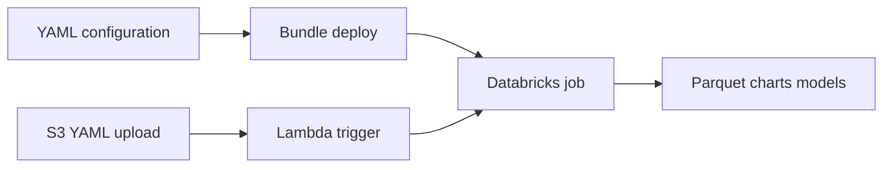

Operators configure workflows in Hydra YAML, deploy the Databricks bundle, and run jobs manually or via S3-triggered Lambda orchestration. Each run records status and metrics in MatchAI database tables.

---

## Core features

- **Training** — Fit a Splink probabilistic linkage model on preprocessed data; log model and charts to MLflow Unity Catalog.
- **Linkage inference** — Match records across two datasets using a trained model, with parallel inference per salt-key pair.
- **Dedupe inference** — Find duplicates within a single dataset, with optional clustering on post-process buckets.
- **Post-processing** — Apply SQL-defined bucket queries over prediction output; generate comparison-viewer charts.
- **Clustering** — Group matched records within buckets using Splink clustering (dedupe workflows only).
- **Profiling** — Profile column completeness and distributions; generate OpenAI-powered insights.
- **S3-triggered runs** — Upload YAML configuration to S3 to automatically trigger the appropriate Databricks job via AWS Lambda.
- **Run tracking** — Every stage records events and metrics to MatchAI database tables (`match_config`, `match_run_detail`, `match_run_event`).

---

## Components

### Initialization

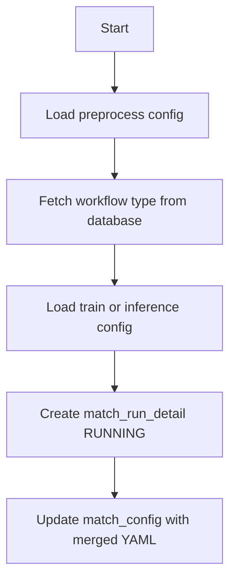

Runs automatically as the first task in training and inference jobs. You provide preprocess YAML with `match_config_id`, `model_name`, `job_run_id`, and source file definitions. You get back a running workflow record in the MatchAI database with status `RUNNING` and a snapshot of the merged configuration.

### Preprocessing

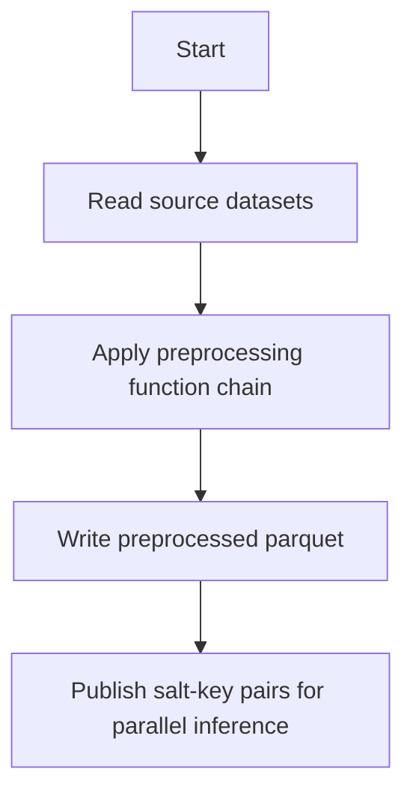

Runs as the preprocess task in training and inference jobs, or triggered via S3 upload with `preprocess.yaml`. You provide preprocess YAML defining source files, preprocessing function chains, `save_path`, `model_name`, and `date_partition`. You get back preprocessed parquet datasets organized by model name, date partition, and job run ID, plus salt-key pairs passed to downstream parallel inference tasks.

### Training

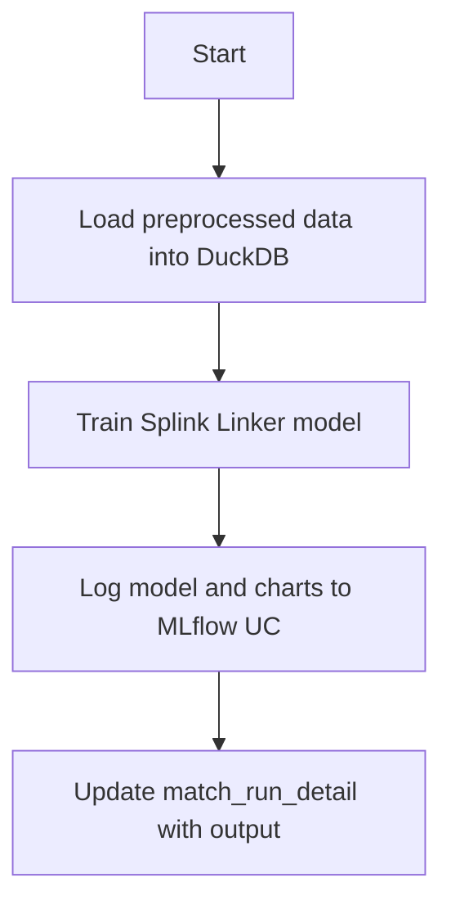

Invoke with `databricks bundle run matchai_training_job -t dev`, or upload training YAMLs to S3. You provide train YAML with `link_type`, blocking rules, comparisons, `recall`, MLflow paths, and Unity Catalog settings. You get back a trained Splink model registered in MLflow, training charts in Unity Catalog volumes, and updated run detail records.

### Inference

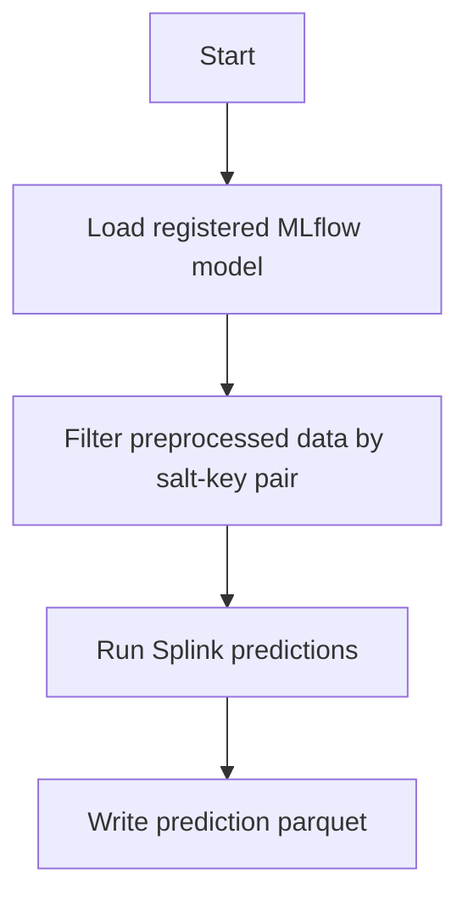

Runs automatically as `matchai_parallel_inference_job` — one invocation per salt-key pair — within linkage or dedupe inference workflows. You provide inference YAML with `model_version`, `model_name`, `salt_key` (set by orchestration), `partition`, and optional `pre_inference_filters`. You get back prediction parquet files partitioned by salt key under the configured save path.

### Post-processing

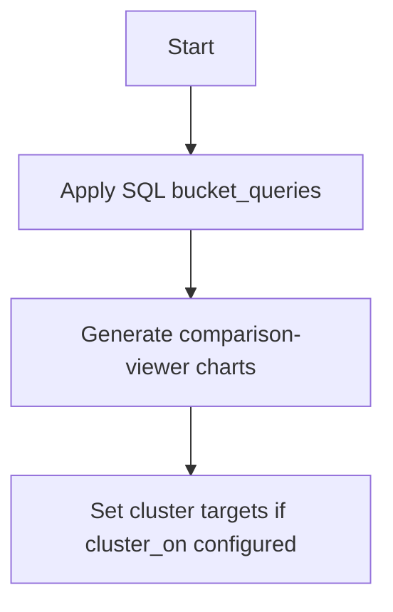

Runs as the post-process task in linkage and dedupe inference jobs. You provide inference YAML with `bucket_queries` (SQL using `__PREDICTIONS__` placeholder) and optional `cluster_on` bucket/threshold pairs. You get back bucket parquet outputs and comparison-viewer charts. For dedupe workflows, cluster target pairs are passed to the clustering stage.

### Clustering

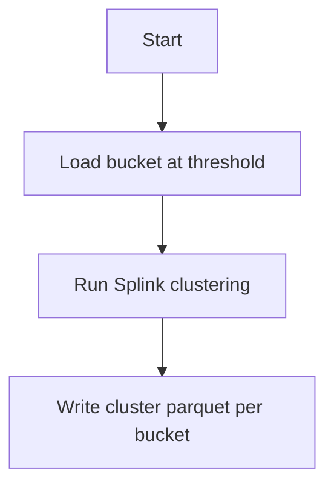

Runs as `matchai_parallel_cluster_job` — one invocation per bucket — within dedupe inference workflows only. You provide cluster YAML with `bucket_name` (format `name:threshold`), `model_version`, and job metadata. You get back per-bucket cluster parquet outputs.

### Join clustered buckets

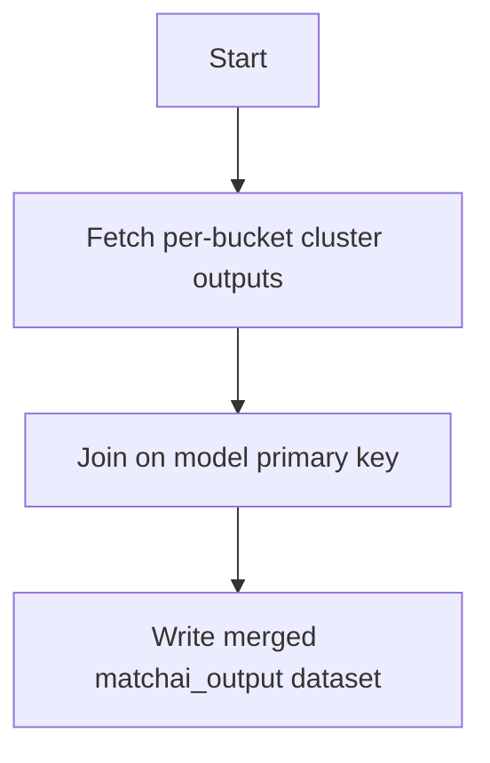

Runs as the join clustered buckets task in `matchai_dedupe_inference_job`, after all parallel cluster jobs complete. You provide inference YAML with `bucket_queries` and `cluster_on` configuration (already loaded by the job). You get back a single joined output dataset with per-bucket cluster ID columns.

### Profiling

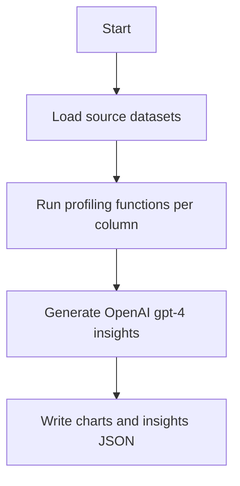

Invoke with `databricks bundle run matchai_profiling_job -t dev`, or upload profiling YAMLs to S3. You provide profiling YAML with source files, `columns_to_profile`, `profiling_functions`, and OpenAI API key in Databricks secrets (`OPENAI_API_KEY` in configured `secret_scope`). You get back column profile charts, completeness charts, and JSON insights files per dataset.

### Termination

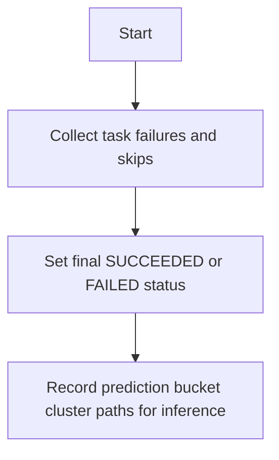

Runs automatically as the final task in training and inference jobs (`run_if: ALL_DONE`). You provide nothing — it runs automatically. You get back final workflow status and output path references in the MatchAI database.

---

## How to run MatchAI workflows

### Prerequisites

1. Install the Databricks CLI and authenticate to your workspace (`databricks configure`).
2. Build the Python wheel:

```bash
python setup.py sdist bdist_wheel
```

Expected result: `dist/` contains `mlp_consumer_match-*.whl`.

### Flow

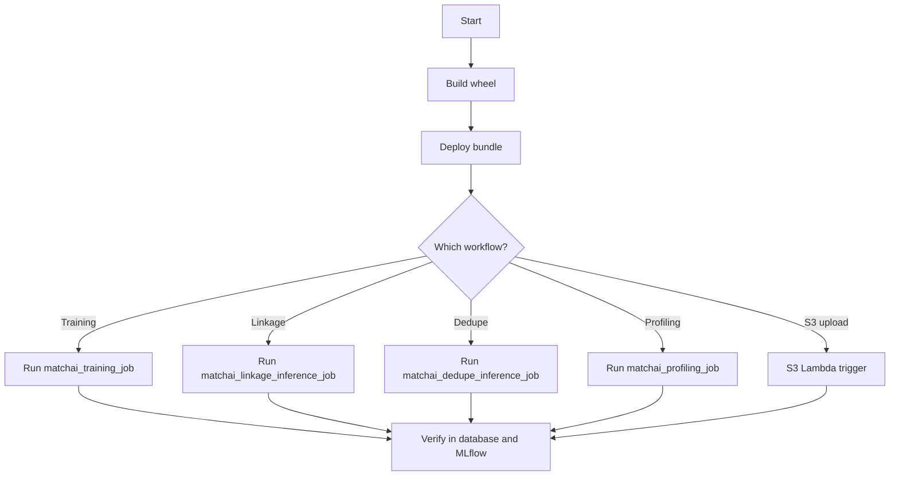

### Deploy the bundle

```bash
databricks bundle deploy --target dev
```

Expected result: Databricks jobs (`matchai_training_job`, `matchai_linkage_inference_job`, `matchai_dedupe_inference_job`, `matchai_profiling_job`, `matchai_parallel_inference_job`, `matchai_parallel_cluster_job`) are deployed to the workspace. Default target is `dev`; use `--target staging` or `--target prod` for other environments.

### Run a training workflow

```bash
databricks bundle run matchai_training_job -t dev
```

Expected result: Job tasks run in order — initialization → preprocess → training → termination. Check Databricks Workflows for task status.

**Verify it worked:** The `match_run_detail` record for the job run ID shows status `SUCCEEDED` and training output in the MatchAI database. MLflow shows a new model version.

### Run a linkage inference workflow

```bash
databricks bundle run matchai_linkage_inference_job -t dev
```

Expected result: Tasks run — initialization → preprocess → parallel inference (one `matchai_parallel_inference_job` per salt-key pair) → post-process → termination.

**Verify it worked:** Prediction parquet files exist under the configured save path. `match_run_detail` output includes `prediction_path` and `buckets_path`.

### Run a dedupe inference workflow

```bash
databricks bundle run matchai_dedupe_inference_job -t dev
```

Expected result: Tasks run — initialization → preprocess → parallel inference → post-process → cluster (one `matchai_parallel_cluster_job` per bucket) → join clustered buckets → termination.

**Verify it worked:** Cluster outputs and joined bucket output exist. `match_run_detail` output includes `prediction_path`, `buckets_path`, and `clusters_path`.

### Run a profiling workflow

```bash
databricks bundle run matchai_profiling_job -t dev
```

Expected result: The profiling task runs and updates `match_run_detail` with chart data and status `SUCCEEDED`.

**Verify it worked:** Profiling charts appear in the Unity Catalog volume path for the job run ID. Insights JSON files are written per dataset.

### Trigger via S3 upload (Lambda orchestration)

Upload YAML configuration files to the configured S3 bucket. The Lambda handler:

1. Parses the S3 path for timestamp, `match_config_id`, and workflow type.
2. Creates a new `match_config` record when `match_config_id` is `MCFG`.
3. Copies YAMLs to Databricks workspace storage under the current user's folder.
4. Triggers the appropriate job:
   - **Training** — when `preprocess.yaml`, `train.yaml`, and `SUCCESS.yaml` exist in the S3 directory. `link_type` must match source file count: `link_only` for two files, `dedupe_only` for one file.
   - **Linkage inference** — when preprocess YAML defines more than one source file, plus `inference.yaml` and `SUCCESS.yaml`.
   - **Dedupe inference** — when preprocess YAML defines exactly one source file, plus `inference.yaml`, `cluster.yaml`, and `SUCCESS.yaml`.
   - **Profiling** — when `profiling.yaml` and `SUCCESS.yaml` exist.

The S3 path must contain a timestamp segment (at least three underscore-separated parts for date partition) and a `match_config_id` segment. Invalid timestamp format returns a permanent failure.

**Verify it worked:** Lambda returns HTTP 200 with body indicating which workflow was triggered. The corresponding Databricks job appears in Workflows with the copied YAML config path.

### Validate bundle tags

```bash
databricks bundle run validate-tags -t dev
```

Expected result: Bundle JSON is validated against the tag CSV for the target environment.

---

## Configuration overview

All workflow parameters are defined in Hydra YAML files. Five configuration types exist: `preprocess`, `train`, `inference`, `cluster`, and `profiling`. At runtime, jobs pass `--config-path` pointing to the YAML directory; Hydra loads the appropriate config by name. Pattern examples below use the default reference configs.

### Preprocess configuration

| Key | Type | Required | Default (reference) | Description |
|-----|------|----------|---------------------|-------------|
| `source.files` | list | Yes | — | List of file entries, each with `file.name`, `file.path`, and `file.preprocessing_functions`. Runtime code reads `cfg.source.files` (not top-level `files`). |
| `model_name` | str | Yes | `new_client` | Model identifier for organizing outputs |
| `job_run_id` | str | Yes | `''` | Databricks job run ID |
| `task_run_id` | str | No | `''` | Databricks task run ID |
| `match_config_id` | str | Yes | `766` | MatchAI configuration record ID |
| `save_path` | str | Yes | — | Base storage path for preprocessed output |
| `date_partition` | str | Yes | `2025_07_31` | Date partition string |
| `database_api_url` | str | Yes | `''` (filled at runtime) | MatchAI database API URL; bundle default is `https://match-ai-dev.data-axle.com` |
| `databricks_host_url` | str | Yes | `''` (filled at runtime) | Databricks workspace URL |
| `secret_scope` | str | Yes | `''` (filled at runtime) | Databricks secret scope name; bundle default is `mlp-match-ai-scope` |
| `secret_key` | str | Yes | `''` (filled at runtime) | Secret key name |
| `sql_warehouse_name` | str | Yes | — | SQL warehouse name; bundle default is `matchai_sql_warehouse` |

### Train configuration

| Key | Type | Required | Default (reference) | Description |
|-----|------|----------|---------------------|-------------|
| `save_path` | str | Yes | — | Base storage path |
| `primary_key` | str | Yes | `unique_id` | Primary key column |
| `cols_to_select` | list[str] | Yes | — | Columns to load for training |
| `pre_train_filters` | list[dict] | No | — | SQL filters per dataset (`filter.name`, `filter.where`) |
| `deterministic_rules` | list[str] | Yes | — | Splink deterministic match rules |
| `blocking_rules` | list[str] | Yes | — | Splink blocking rules |
| `comparisons` | dict | Yes | — | Named comparison definitions with comparison levels |
| `link_type` | str | Yes | `link_only` | Problem type: `link_only` (two source files) or `dedupe_only` (one source file) |
| `recall` | float | Yes | `0.8` | Target recall for threshold tuning |
| `estimate_u_max_pairs` | int | Yes | `1e9` | Max pairs for u-probability estimation |
| `max_rows_limit` | int | Yes | `100000000` | Max rows for training |
| `em_convergence` | float | Yes | `0.0001` | EM convergence threshold |
| `model_save_path` | str | Yes | `main.generic_match` | MLflow model save path |
| `model_version` | str | Yes | `5` | Model version tag |
| `mlflow_tracking_uri` | str | Yes | `databricks` | MLflow tracking URI |
| `mlflow_registry_uri` | str | Yes | `databricks-uc` | MLflow registry URI |
| `mlflow_experiment_root` | str | Yes | `/mlp-root/dev` | MLflow experiment root |
| `uc_catalog` | str | Yes | `''` (filled at runtime) | Unity Catalog catalog; bundle default is `main` |
| `uc_schema` | str | Yes | `''` (filled at runtime) | Unity Catalog schema; bundle default is `generic_match` |
| `uc_volume` | str | Yes | `''` (filled at runtime) | Unity Catalog volume; bundle default is `artifacts` |

### Inference configuration

| Key | Type | Required | Default (reference) | Description |
|-----|------|----------|---------------------|-------------|
| `partition` | str | Yes | `1` | Partition identifier for this inference task |
| `save_path` | str | Yes | — | Base storage path |
| `model_version` | str | Yes | `5` | MLflow model version to load |
| `model_name` | str | Yes | `''` (set by orchestration) | Model name |
| `model_save_path` | str | Yes | `main.generic_match` | MLflow model save path |
| `salt_key` | str | Yes | — (set by orchestration) | Salt-key pair string |
| `bucket_queries` | list[dict] | No | — | SQL bucket definitions (`query.name`, `query.sql`, `query.generate_comparison_viewer`) |
| `cluster_on` | list[dict] | No | — | Buckets to cluster (`bucket.name`, `bucket.threshold`) |
| `pre_inference_filters` | list[dict] | No | — | SQL filters before inference |
| `generate_comparison_viewer` | bool | No | — | Whether to generate comparison viewer charts |
| `num_example_rows` | int | No | `5` | Example rows in comparison viewer |
| `mlflow_tracking_uri` | str | Yes | `databricks` | MLflow tracking URI |
| `mlflow_registry_uri` | str | Yes | `databricks-uc` | MLflow registry URI |

When `bucket_queries` is omitted, a default bucket selecting all predictions is used.

### Cluster configuration

| Key | Type | Required | Default (reference) | Description |
|-----|------|----------|---------------------|-------------|
| `bucket_name` | str | Yes | `''` (set by orchestration) | Bucket name and threshold as `name:threshold` |
| `model_name` | str | Yes | `''` (set by orchestration) | Model name |
| `job_run_id` | str | Yes | `''` | Job run ID |
| `task_run_id` | str | No | `''` | Task run ID |
| `match_config_id` | str | Yes | `765` | Match config ID |
| `date_partition` | str | Yes | `''` | Date partition |
| `save_path` | str | Yes | — | Base storage path |
| `model_version` | str | Yes | `2` | MLflow model version |
| `model_save_path` | str | Yes | `main.generic_match` | MLflow model save path |
| `mlflow_tracking_uri` | str | Yes | `databricks` | MLflow tracking URI |
| `mlflow_registry_uri` | str | Yes | `databricks-uc` | MLflow registry URI |

### Profiling configuration

| Key | Type | Required | Default (reference) | Description |
|-----|------|----------|---------------------|-------------|
| `source.files` | list | Yes | — | File entries with `file.name`, `file.path`, and `file.columns_to_profile` |
| `profiling_functions` | list | Yes | — | Profiling function entries (`completeness_chart`, `profile_columns` with `params`) |
| `model_name` | str | Yes | `new_client` | Model identifier |
| `job_run_id` | str | Yes | `''` | Job run ID |
| `save_path` | str | Yes | — | Base storage path for profiling output |
| `date_partition` | str | Yes | `2025_07_31` | Date partition |
| `database_api_url` | str | Yes | `''` (filled at runtime) | MatchAI database API URL |
| `secret_scope` | str | Yes | `''` (filled at runtime) | Databricks secret scope for OpenAI API key |
| `match_config_id` | str | Yes | `766` | Match config ID |
| `uc_catalog` | str | Yes | `''` (filled at runtime) | Unity Catalog catalog |
| `uc_schema` | str | Yes | `''` (filled at runtime) | Unity Catalog schema |
| `uc_volume` | str | Yes | `''` (filled at runtime) | Unity Catalog volume |
